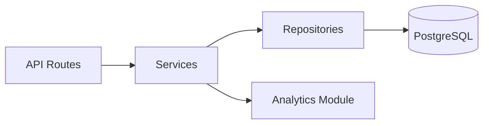

# Football Match Intelligence API

Production-style FastAPI coursework project for COMP3011.

It delivers CRUD APIs on football domain models, SQL-backed persistence, advanced analytics endpoints, reproducible dataset import, and provenance-aware analytics output.

## Project Overview

- Framework: FastAPI (Python 3.11)
- Persistence: SQLAlchemy 2.0 + Alembic migrations + PostgreSQL
- Validation/serialization: Pydantic
- Testing: Pytest
- Dataset integration: Fantasy Premier League API scrape for Premier League 2025/26
- Frontend: lightweight HTML/CSS/JavaScript dashboard served by FastAPI at `/`

## Architecture

Layered architecture is enforced:

`API Routes -> Services -> Repositories -> Database`



Repository layer is the only layer that performs database queries.

## Core Features

- Full CRUD for `Team`, `Player`, and `Match`
- Event ingestion endpoints (`create`, `list`)
- Pagination support on list endpoints (`skip`, `limit`)
- Structured error responses and HTTP status handling (`201`, `204`, `404`, `409`, `422`)
- Analytics endpoints with provenance metadata:
  - `data_source`
  - `dataset_name`
  - `dataset_version`
  - `computed_at`

## Setup Instructions

## 1) Prerequisites

- Python `3.11.x`
- PostgreSQL (local install or managed host)

## 2) Clone and configure environment

```bash
cp .env.example .env
```

Edit `.env` if your DB host/user/password differ.

Set `API_KEY` in `.env` for protected write endpoints.

## 3) Install dependencies

```bash
python3 -m pip install -e .[dev]
```

## 4) Create database and run migrations

Example (local postgres user):

```bash
createdb football_api
python3 -m alembic upgrade head
```

## 5) Run API

```bash
uvicorn app.main:app --reload
```

Docs:

- Local frontend: `http://127.0.0.1:8000/`
- Local Swagger UI: `http://127.0.0.1:8000/docs`
- Local ReDoc: `http://127.0.0.1:8000/redoc`
- Live site: `https://football-match-intelligence-api.onrender.com`
- Live Swagger UI: `https://football-match-intelligence-api.onrender.com/docs`

## Running Tests

```bash
python3 -m pytest -q
```

Optional sanity compile:

```bash
python3 -m compileall app
```

## API Endpoints

## Health

- `GET /health`

## Teams CRUD

- `POST /teams`
- `GET /teams`
- `GET /teams/{team_id}`
- `PUT /teams/{team_id}`
- `DELETE /teams/{team_id}`

## Players CRUD

- `POST /players`
- `GET /players`
- `GET /players/{player_id}`
- `PUT /players/{player_id}`
- `DELETE /players/{player_id}`

## Matches CRUD

- `POST /matches`
- `GET /matches`
- `GET /matches/{match_id}`
- `PUT /matches/{match_id}`
- `DELETE /matches/{match_id}`

## Events

- `POST /events`
- `GET /events`

## Fixtures

- `GET /fixtures`

## Analytics

- `GET /analytics/team-form/{team_id}` (explainable form score)
- `GET /analytics/league-table`
- `GET /analytics/top-scorers`
- `GET /analytics/most-assists`
- `GET /analytics/team-strength` (ELO-style rating)
- `GET /analytics/player-impact`
- `GET /analytics/clutch-impact` (points won by decisive goals/assists)
- `GET /analytics/fixture-predictions`

## Authentication

Write endpoints require `X-API-Key` header:

```bash
curl -X POST http://127.0.0.1:8000/teams \
  -H "Content-Type: application/json" \
  -H "X-API-Key: dev-api-key" \
  -d '{"name":"Arsenal","league":"Premier League","country":"England"}'
```

Write endpoints also have in-memory rate limiting controlled by:

- `RATE_LIMIT_WINDOW_SECONDS`
- `RATE_LIMIT_MAX_REQUESTS`

Swagger UI documents the `X-API-Key` security header and common write-route error responses including:

- `401` missing API key
- `403` invalid API key
- `404` resource not found
- `409` duplicate resource conflict
- `422` validation or relationship error
- `429` rate limit exceeded

### Player impact metric

Implemented as:

`impact_score = (goals*5) + (assists*3) + (shots_on_target*1) + (saves*0.2) - (yellow_cards*0.5) - (red_cards*2)`

## Structured Error Response

Example:

```json
{
  "detail": {
    "error": {
      "code": "TEAM_NOT_FOUND",
      "message": "Team with id 999 not found"
    }
  }
}
```

## Dataset Integration

Dataset used:

- Name: Premier League 2025/26
- Source: Fantasy Premier League API
- Scope: Premier League teams, players, finished fixtures, and per-fixture player-stat-derived event rows

Important:

- Scraped dataset output is written to `data/premier_league_2025_26/`.
- Small reproducible subset for tests remains under `data/sample/`.

### Scrape dataset

Generate a fresh Premier League dataset:

```bash
python3 scripts/scrape_premier_league_2025_26.py
```

The scraper builds `events.csv` from each player's per-fixture `element-summary` history,
which makes goals and assists match-specific rather than gameweek-aggregated.

### Import dataset

Dry-run (validation only):

```bash
python3 scripts/import_football_events.py --dataset-dir data/premier_league_2025_26 --dry-run
```

Commit import:

```bash
python3 scripts/import_football_events.py --dataset-dir data/premier_league_2025_26
```

Script behavior:

- Parses CSV input (`teams`, `players`, `matches`, `events`, optional `fixtures`)
- Validates references between entities
- Skips duplicates (idempotent re-runs)
- Prints per-entity import statistics

## Render Deployment

This repo includes deployment support files for Render:

- [`render.yaml`](/Users/haroonbostan/football-api-cwk/football-match-intelligence-api/render.yaml)
- [`scripts/render_start.sh`](/Users/haroonbostan/football-api-cwk/football-match-intelligence-api/scripts/render_start.sh)

Recommended free-tier deployment flow:

1. Create a Render Postgres instance.
2. Create a Render Web Service from this repository.
3. Set the build command to:

```bash
pip install ".[dev]"
```

4. Set the start command to:

```bash
bash scripts/render_start.sh
```

5. Add these environment variables in the Render Web Service:

- `PYTHON_VERSION=3.11.11`
- `ENVIRONMENT=production`
- `DATABASE_URL=<Render Postgres External Database URL>`
- `API_KEY=<generated or custom secret>`
- `RATE_LIMIT_WINDOW_SECONDS=60`
- `RATE_LIMIT_MAX_REQUESTS=30`

The startup script will:

- run `alembic upgrade head`
- import `data/premier_league_2025_26`
- start `uvicorn`

### Important environment variables

Required in production:

- `DATABASE_URL`
- `API_KEY`
- `ENVIRONMENT`
- `RATE_LIMIT_WINDOW_SECONDS`
- `RATE_LIMIT_MAX_REQUESTS`

### Notes

- The app normalizes Render Postgres URLs to the SQLAlchemy `postgresql+psycopg://` format automatically.
- The service health check uses `/health`.
- After deploy, the frontend is available at the root path `/`.
- Swagger UI is available at `/docs`.

## OpenAPI Export

API documentation artifacts in the repository:

- Live site: `https://football-match-intelligence-api.onrender.com`
- Live Swagger UI: `https://football-match-intelligence-api.onrender.com/docs`
- OpenAPI JSON: [`docs/openapi_export.json`](/Users/haroonbostan/football-api-cwk/football-match-intelligence-api/docs/openapi_export.json)
- Swagger PDF: [`docs/Football Match Intelligence API - Swagger UI-Authorisation.pdf`](/Users/haroonbostan/football-api-cwk/football-match-intelligence-api/docs/Football%20Match%20Intelligence%20API%20-%20Swagger%20UI-Authorisation.pdf)

OpenAPI JSON export command:

```bash
python3 - <<'PY'
import json
from pathlib import Path
from app.main import app

Path("docs").mkdir(exist_ok=True)
Path("docs/openapi_export.json").write_text(json.dumps(app.openapi(), indent=2), encoding="utf-8")
print("Exported docs/openapi_export.json")
PY
```

PDF conversion command (when a converter is available, e.g., `pandoc`):

```bash
pandoc docs/openapi_export.json -o docs/openapi_export.pdf
```

## References

- FastAPI: https://fastapi.tiangolo.com/
- SQLAlchemy 2.0: https://docs.sqlalchemy.org/en/20/
- Alembic: https://alembic.sqlalchemy.org/
- FPL API: https://fantasy.premierleague.com/api/bootstrap-static/
